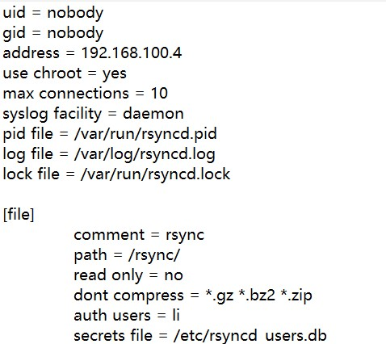

# /etc/rsyncd.conf

上一篇 [rsync演示02](03_rsync_demo02.zh.md) 我们介绍了一些基本的参数，本篇是做另外参数的补充。 本篇是做另外参数的补充。

| 参数                                  | 说明                                                                                                                                                                 |
| ----------------------------------- | ------------------------------------------------------------------------------------------------------------------------------------------------------------------ |
| fake super  = yes                   | yes表示不需要daemon以root运行，就可以存储文件的完整属性。                                                                                                                                |
| uid =                               |                                                                                                                                                                    |
| gid =                               | 两个参数用来指定当以root身份运行rsync守护进程时，指定传输文件所使用的用户和组，默认都是nobody 默认是nobody                                                                                                   |
| use chroot  =  yes                  | 传输前是否需要进行根目录的锁定，yes是，no否。 rsync为了增加安全性，默认值为yes。                                                                                                                    |
| max  connections  =  4              | 允许最大的连接数，默认值为0，表示不做限制                                                                                                                                              |
| lock file = /var/run/rsyncd.lock    | 指定的锁文件，和“max  connections ”参数关联                                                                                                                                    |
| exclude  =  lost+found/             | 排除不需要传输的目录                                                                                                                                                         |
| transfer logging  =  yes            | 是否启用类似ftp的日志格式来记录rsync的上传和下载                                                                                                                                       |
| timeout =  900                      | 指定超时时间。 指定超时的时间，如果在指定时间内没有数据被传输，则rsync将直接退出。 单位为秒，默认值为0表示永不超时                                                                                                      |
| ignore nonreadable = yes            | 是否忽略用户没有访问权限的文件                                                                                                                                                    |
| motd file = /etc/rsyncd/rsyncd.motd | 用于指定消息文件的路径。 默认情况下，是没有 motd 文件的。 这个消息就是当用户登录以后显示的欢迎信息。                                                                                                             |
| hosts allow = 10.1.1.1/24           | 用于指定哪些IP或者网段的客户端允许访问。 可填写ip、网段、主机名、域下面的主机，多个用空格隔开。 默认允许所有人访问                                                                                                       |
| hosts deny =  10.1.1.20             | 用户指定哪些ip或者网段的客户端不允许访问。 如果hosts allow和hosts deny有相同的匹配结果，则该客户端最终不能访问。 如果客户端的地址即不在hosts allow中，也不在hosts deny中，则该客户端允许访问。 默认情况下，没有该参数                                 |
| auth  users = li                    | 启用虚拟用户，多个用户用英语状态的逗号进行隔开                                                                                                                                            |
| syslog facility  = daemon           | 定义系统日志的级别， 有这些值可填：auth、authpriv、cron、daemon、ftp、kern、lpr、mail、news、 security、syslog、user、uucp、 local0、local1、local2、local3、local4、local5、local6和local7。 默认值是daemon |

## 推荐的配置

