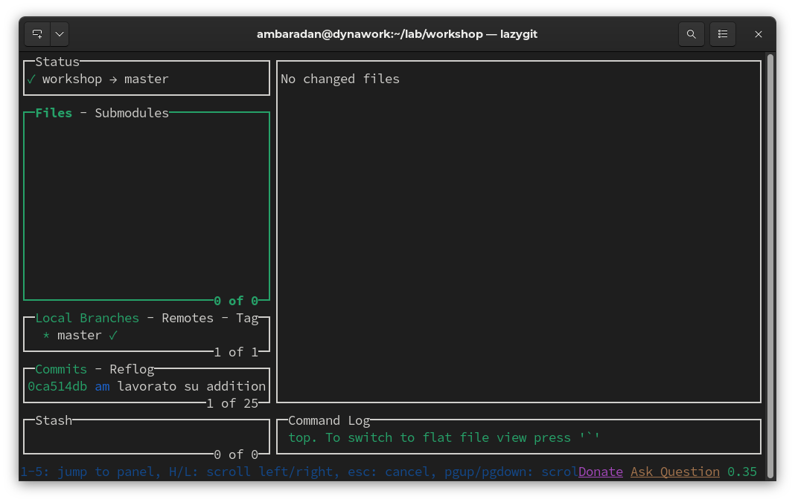

# Additional Software Needed

There are several pieces of additional software that, while not required, will aid in the overall use of NvChad. The sections below will walk you through that software and its uses.

## RipGrep

`ripgrep` is a line-oriented search tool that recursively searches the current directory for a _regex_ (regular expression) pattern. By default, _ripgrep_ respects the rules of _gitignore_ and automatically skips hidden files/directories and binaries. Ripgrep offers excellent support on Windows, macOS and Linux, with binaries available for each release.

Ripgrep is software written in _Rust_ and is installable with the `cargo` utility. Note, however, that `cargo` is not installed by the default installation of _rust_ so you have to install it explicitly.

```bash
dnf install rust cargo
```

Once the necessary software is installed, we can install `ripgrep` with:

```bash
cargo install ripgrep
```

The installation will save the `rg` executable in the `~/.cargo/bin` folder which is outside the PATH, to use it at the user level we will link it to `~/.local/bin/`.

```bash
ln -s ~/.cargo/bin/rg ~/.local/bin/
```

At this point we can check that everything is okay with:

```bash
rg --version
ripgrep 13.0.0
-SIMD -AVX (compiled)
+SIMD +AVX (runtime)
```

RipGrep is needed for recursive searches with `:Telescope`.

## Lazygit

[LazyGit](https://github.com/jesseduffield/lazygit) is an ncurses-style interface that allows you to perform all `git` operations in a more user-friendly way. It is required by the _lazygit.nvim_ plugin. This plugin makes it possible to use LazyGit directly from NvChad, it opens a floating window from where you can perform all operations on your repositories, thus allowing you to make all changes to the _git repository_ without leaving the editor.

To install it we can use the repository for Fedora. On Rocky Linux 9 it works perfectly.

```bash
sudo dnf copr enable atim/lazygit -y
sudo dnf install lazygit
```

Once installed we open a terminal and type the command `lazygit` and an interface similar to this will appear: 



With the <kbd>x</kbd> key, we can bring up the menu with all available commands.


Now that we have all the necessary supporting software on our system we can move on to installing the basic software. We will start with the editor on which the whole configuration is based, [Neovim](install_nvim.md).
