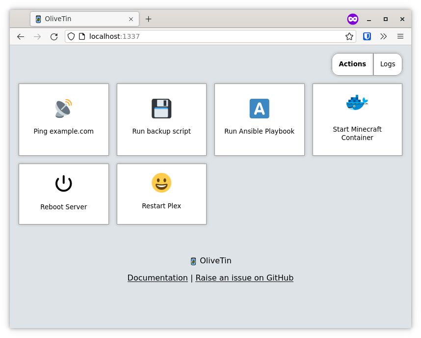
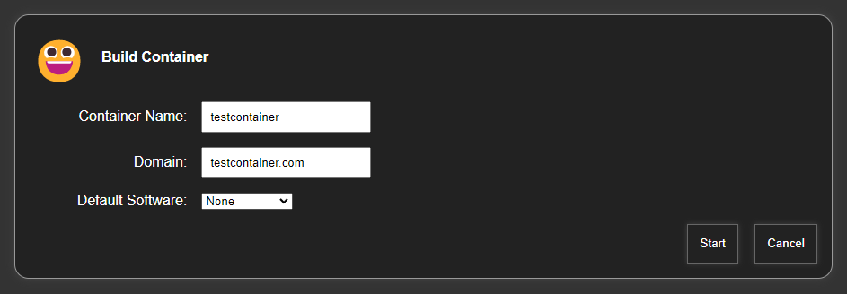

# Come installare e utilizzare OliveTin su Rocky Linux

## Introduzione

Vi siete mai stancati di digitare sempre gli stessi comandi CLI? Avete mai voluto che tutti gli altri in casa vostra potessero riavviare il server Plex senza il vostro intervento? Volete semplicemente digitare un nome in un pannello web, premere un pulsante e vedere apparire magicamente un contenitore Docker/LXD personalizzato?

Allora potreste voler dare un'occhiata a OliveTin. OliveTin è letteralmente solo un'applicazione che consente di generare una pagina web da un file di configurazione, e questa pagina web ha dei pulsanti. Premendo i pulsanti, OliveTin eseguirà i comandi bash preimpostati da voi.

Certo, tecnicamente si potrebbe creare qualcosa di simile da soli, da zero, con una sufficiente esperienza di programmazione... ma questo è *molto* più semplice. L'aspetto è simile a questo quando è configurato (immagine per gentile concessione del [repository OliveTin](https://https://github.com/OliveTin/OliveTin)):



!!! Avvertenza "Non eseguire MAI questa applicazione su un server pubblico"

    Questa applicazione, per progettazione e per ammissione dello stesso creatore, è destinata a essere utilizzata su reti locali, *forse* su configurazioni dev. Tuttavia, al momento non ha un sistema di autenticazione dell'utente e (finché lo sviluppatore non lo risolverà) *viene eseguito come root per impostazione predefinita*.
    
    Quindi sì, usatelo quanto volete su una rete protetta e difesa da firewall. *Non* metterlo su nulla che sia destinato all'uso da parte del pubblico. Per ora fare:

## Prerequisiti e presupposti

Per seguire questa guida è necessario

* Una macchina con Rocky Linux
* Un minimo di comfort/esperienza con la riga di comando.
* Accesso root o capacità di usare `sudo`.
* Per imparare le basi di YAML. Non è difficile; ne prenderete coscienza più in basso.

## Installazione di OliveTin

Questa è la parte più facile: OliveTin viene fornito con RPM pre-costruiti. È sufficiente scaricare qui l'ultima versione per la propria architettura e installarla. Se state seguendo questa guida su una workstation con un desktop grafico, scaricate il file e fate doppio clic su di esso nel vostro file manager preferito.

Se si sta installando questa applicazione su un server, è possibile scaricarla sul proprio computer di lavoro e caricarla tramite SSH/SCP/SFTP, oppure fare la cosa che alcuni dicono di non fare e scaricarla con `wget`.

ad es.

```bash
wget https://github.com/OliveTin/OliveTin/releases/download/2022-04-07/OliveTin_2022-04-07_linux_amd64.rpm
```

Quindi installare l'applicazione con (sempre ad esempio):

```bash
sudo rpm -i OliveTin_2022-04-07_linux_amd64.rpm
```

Ora OliveTin può essere eseguito come un normale servizio `systemd`, ma non bisogna ancora abilitarlo. È necessario impostare prima il file di configurazione.

!!! Note "Nota"

    Dopo alcune prove, ho stabilito che queste stesse istruzioni di installazione funzionano perfettamente in un contenitore Rocky Linux LXD. Per chi ama Docker, sono disponibili immagini precostituite.

## Configurazione delle azioni OliveTin

OliveTin può fare tutto ciò che può fare bash, e anche di più. Si può usare per eseguire applicazioni con opzioni CLI, eseguire script bash, riavviare servizi, ecc. Per iniziare, aprire il file di configurazione con l'editor di testo desiderato con root/sudo:

```bash
sudo nano /etc/OliveTin/config.yaml
```

Il tipo di azione più elementare è un semplice pulsante; si fa clic su di esso e il comando viene eseguito sul computer host. Si può definire nel file YAML in questo modo:

```yaml
actions:
  - title: Restart Nginx
    shell: systemctl restart nginx
```

È inoltre possibile aggiungere icone personalizzate a ogni azione, come nel caso delle emoji unicode:

```yaml
actions:
  - title: Restart Nginx
    icon: "&#1F504"
    shell: systemctl restart nginx
```

Non mi soffermerò su tutti i dettagli delle opzioni di personalizzazione, ma è anche possibile utilizzare gli input di testo e i menu a discesa per aggiungere variabili e opzioni ai comandi da eseguire. Se lo fate, OliveTin vi chiederà un input prima di eseguire il comando.

In questo modo è possibile eseguire qualsiasi programma, controllare macchine remote tramite SSH, attivare webhook e altro ancora. Consultate [la documentazione ufficiale](https://docs.olivetin.app/actions.html) per ulteriori idee.

Ma ecco un mio esempio: Ho uno script personale che uso per generare contenitori LXD con server web preinstallati. Con OliveTin, sono riuscito a creare rapidamente un'interfaccia grafica per questo script, come questa:

```yaml
actions:
- title: Build Container
  shell: sh /home/ezequiel/server-scripts/rocky-host/buildcontainer -c {{ containerName }} -d {{ domainName }} {{ softwarePackage }}
  timeout: 60
  arguments:
    - name: containerName
      title: Container Name
      type: ascii_identifier

    - name: domainName
      title: Domain
      type: ascii_identifier

    - name: softwarePackage
      title: Default Software
      choices:
        - title: None
          value:

        - title: Nginx
          value: -s nginx

        - title: Nginx & PHP
          value: -s nginx-php

        - title: mariadb
          value: -s mariadb
```

Sul front end, l'aspetto è questo (e sì, OliveTin ha una modalità scura e devo *assolutamente* cambiare l'icona):



## Abilitazione di OliveTin

Una volta creato il file di configurazione nel modo desiderato, è sufficiente attivare e avviare OliveTin con:

```bash
sudo systemctl enable --now OliveTin
```

Ogni volta che si modifica il file di configurazione, è necessario riavviare il servizio nel modo consueto:

```bash
sudo systemctl restart OliveTin
```

## Conclusione

OliveTin è un ottimo modo per eseguire qualsiasi cosa, da semplici comandi bash a operazioni piuttosto complesse tramite script. Tenete presente, però, che tutto viene eseguito come root per impostazione predefinita, a meno che non usiate su/sudo nei vostri comandi di shell per cambiare l'utente per quel particolare comando.

Per questo motivo, è necessario prestare attenzione a come si configura l'intero sistema, soprattutto se si prevede di fornire l'accesso (ad esempio) alla propria famiglia, per controllare i server e gli elettrodomestici di casa, ecc.

E ancora, non mettetelo su un server pubblico a meno che non siate pronti a cercare di proteggere la pagina da soli.

Altrimenti, divertitevi. Si tratta di un piccolo strumento molto utile.
