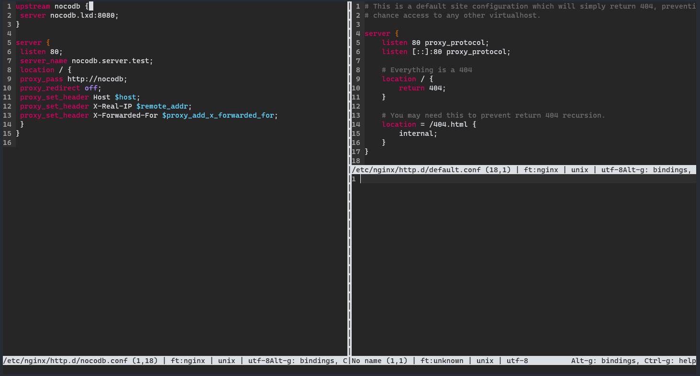

# Installare micro su Rocky Linux

## Introduzione

*[micro](https://micro-editor.github.io)* è un piccolo e fantastico editor di testo basato su terminale che si colloca tra *nano* e *vim* in termini di complessità. Ha un flusso di lavoro semplice e facilmente riconoscibile, con diverse caratteristiche straordinarie:

* Tutti i consueti comandi "Control-C", "Control-V" e "Control-F" funzionano come in un editor di testo basato su desktop. Naturalmente, tutte le associazioni di tasti possono essere reimpostate.
* Supporto del mouse — fare clic e trascinare per selezionare il testo, fare doppio clic per selezionare le parole, fare triplo clic per selezionare le righe.
* Oltre 75 lingue supportate con evidenziazione della sintassi per impostazione predefinita.
* Cursori multipli per modificare più righe alla volta.
* Include un sistema di plugin.
* Pannelli multipli.

Ed ecco come appare nel mio terminale:



!!! Note "Nota"

    È possibile installare micro tramite un'applicazione snap. Se si utilizza già snap sulla macchina... Voglio dire... perché no? Ma io preferisco prenderlo direttamente dalla fonte.

## Prerequisiti

* Qualsiasi macchina o contenitore Rocky Linux connesso a Internet.
* Conoscenza di base della riga di comando e desiderio di modificare il proprio testo.
* Alcuni comandi dovranno essere eseguiti come root o con `sudo`.

### Come Installare micro

Questa è forse la guida più semplice che ho scritto finora, con esattamente tre comandi. Per prima cosa, ci si assicura che *tar* e *curl* siano installati. Questo dovrebbe essere rilevante solo se si sta eseguendo un'installazione minimale di Rocky o se lo si esegue all'interno di un contenitore.

```bash
sudo dnf install tar curl
```

Successivamente, è necessario il programma di installazione dal sito web di *micro*. Il seguente comando otterrà il programma di installazione e lo eseguirà nella directory in cui si sta lavorando. So che di solito non consigliamo di copiare e incollare i comandi dai siti web, ma questo non mi ha mai dato problemi.

```bash
curl https://getmic.ro | bash
```

Per installare l'applicazione a livello di sistema (in modo da poter semplicemente digitare "micro" per aprirla), si può eseguire lo script come root all'interno di `/usr/bin/`. Tuttavia, se volete prima controllare e procedere con cautela, potete installare *micro* in qualsiasi cartella vogliate, per poi spostare l'applicazione in un secondo momento:

```bash
sudo mv micro /usr/bin/
```

E questo è quanto! Buon editing del testo.

### Il Modo Più Semplice

Ho creato uno script semplicissimo che in pratica esegue tutti questi comandi. Potete trovarlo nel mio [gist di Github](https://gist.github.com/EzequielBruni/0e29f2c0a63500baf6fe9e8c51c7b02f) e copiare/incollare il testo in un file sul vostro computer, oppure scaricarlo con `wget`.

## Disinstallazione di micro

Andate nella cartella in cui avete installato *micro* e (usando i vostri poteri divini di root, se necessario) eseguite:

```bash
rm micro
```

Inoltre, *micro* lascerà alcuni file di configurazione nella vostra home directory (e nelle home directory di ogni utente che lo ha eseguito). È possibile eliminarli con:

```bash
rm -rf /home/[nomeutente]/.config/micro
```

## Conclusione

Se volete una guida completa all'uso di *micro*, consultate il [sito web principale](https://micro-editor.github.io) e la documentazione nella [repo di Github](https://github.com/zyedidia/micro/tree/master/runtime/help). È anche possibile premere "Control-G" per aprire il file di guida principale all'interno dell'applicazione stessa.

probabilmente*micro* non soddisferà le esigenze di coloro che si sono dedicati all'esperienza di *vim* o *emacs*, ma è perfetto per le persone come me. Ho sempre desiderato l'esperienza del vecchio Sublime Text nel terminale e ora ho qualcosa di *veramente* vicino.

Provate e vedete se funziona per voi.
